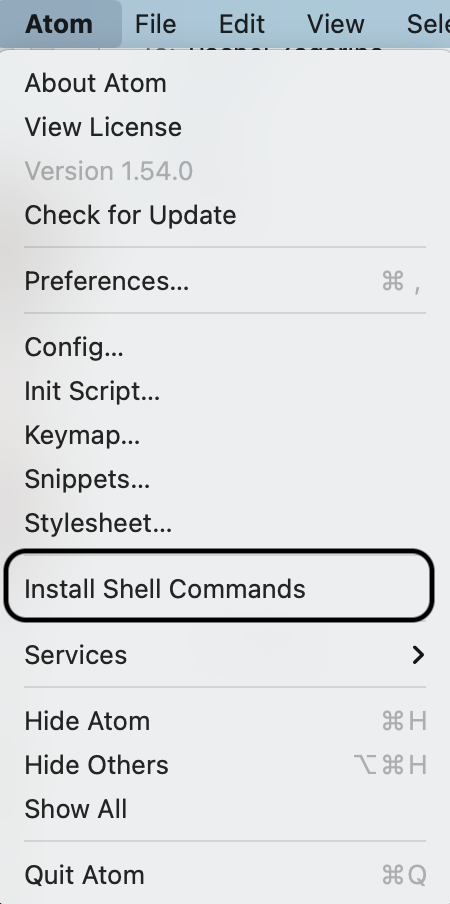

# Interfacing with the clusters
{: .no_toc }

## Table of contents
{: .no_toc .text-delta }

1. TOC
{:toc}

# Connecting to the clusters

This is covered in the cluster specific documentation, but for completeness:

If you are using a Mac, first install [OSXFuse](https://github.com/osxfuse/osxfuse/releases/download/macfuse-4.0.5/macfuse-4.0.5.dmg) and [SSHFS](https://github.com/osxfuse/sshfs/releases/download/osxfuse-sshfs-2.5.0/sshfs-2.5.0.pkg). You should not need it for this, but you should, in general, have [X11](https://www.xquartz.org/).

PMACS

```bash
#my username is mb3152
#login
ssh -Y mb3152@scisub.pmacs.upenn.edu
#mount to your home directory on pmacs, using a local directory called "/Users/maxwell/upenn/"
sshfs mb3152@sciget.pmacs.upenn.edu:/home/mb3152 /Users/maxwell/upenn/ -o follow_symlinks
```
CUBIC
```bash
#my username is bertolem
#login
ssh -Y bertolem@cubic-login.uphs.upenn.edu
#mount to your home directory on pmacs, using a local directory called "/Users/maxwell/CUBIC/"
sshfs bertolem@cubic-login.uphs.upenn.edu://cbica/home/bertolem/ /Users/maxwell/CUBIC/ -o follow_symlinks
```

## Text Editor

We support [Atom](https://atom.io), as it allows you to code interactively using a kernal you start on the cluster. What does this mean? It means you have a nice shiny IDE, but you are using the software and data on the cluster. Best of all worlds. VSCode has the same capabilities, but we only document The Way for Atom.

Once you have downloaded and installed Atom, install the atom-hydrogen package. You can install this and any other package you want from the Atom toolbar:

Packages > Settings View > Install Packages / Themes

Type hydrogen into the search:



Go into the Preferences for Atom: File > Preferences.
Select Packages on the left, and then click on the Settings button for Hydrogen.


Scroll down to the Kernal Gateways Section

Type this in the box:
[{
  "name": "Remote server",
  "options": {
    "baseUrl": "http://localhost:9998"
  }
}]

#local terminal 
ssh -Y mb3152@scisub.pmacs.upenn.edu
#cluster
jupyter notebook --no-browser --NotebookApp.token='' --port=9999
#local terminal
ssh -N -f -L localhost:9998:localhost:9999  mb3152@scisub.pmacs.upenn.edu


##


